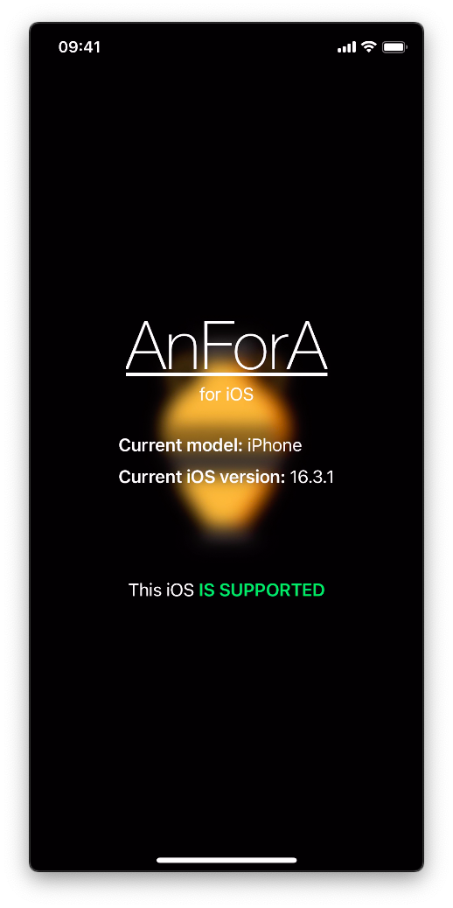
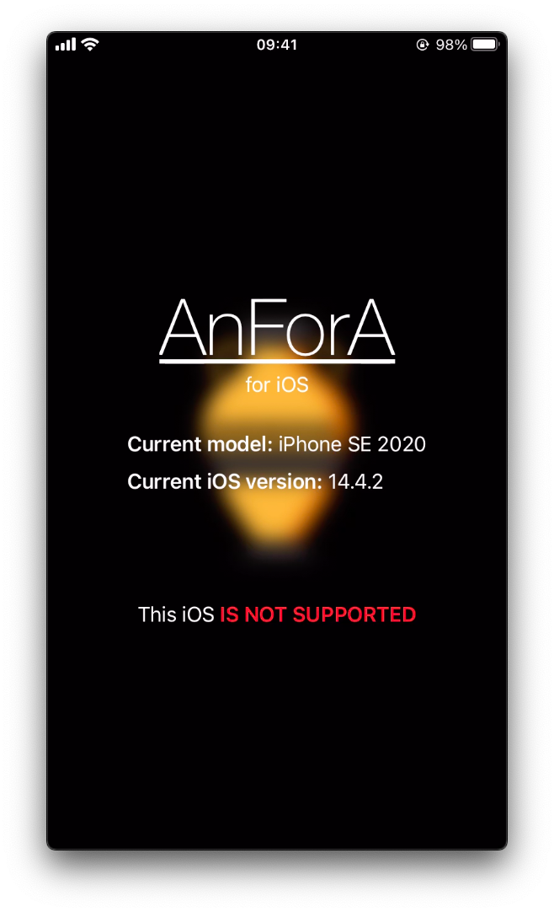

# blank-app

This app is an experiment. I configured the property `MinimumOSVersion` with the value `15.0`. So this app requires iOS 15+, but if you change `MinimumOSVersion` inside `Info.plist` you can install it on iOS 14.

It's important to notice that this is a simple app. If a developer team sets a specific minimum iOS version it means that it requires some specific features that are not present in previous iOS versions.

## How to pack it into IPA?

1. Clone this project:
   ```shell
   git clone --depth=1 -j8 https://github.com/miticollo/blank-app.git
   ```
2. Open it with Xcode.
3. Build it.
4. After that discover path where `.app` directory is located.
5. Run `build.sh` with the path of previous step.

<p align="center">
  
</p>

The two IPAs are in the same folder of `.app` directory.

## Result

iPhone X with iOS 16.3.1          |  iPhone SE 2020 with iOS 14.4.2 
:--------------------------------:|:----------------------------------:
  |  
