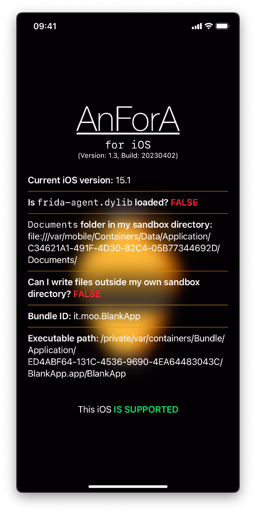

# blank-app

This app is an experiment. 
I configured the property `MinimumOSVersion` with the value `15.0`. So this app requires iOS 15+, but if you change `MinimumOSVersion` inside `Info.plist` you can install it on iOS 14.

It's important to notice that this is a simple app. 
If a developer team sets a specific minimum iOS version it means that it requires some specific features that are not present in previous iOS versions.

Furthermore after compiling it you can find in `build_trollstore` an IPA that you **must** install with [TrollStore](https://github.com/opa334/TrollStore). 
The different with IPAs in `build` folder is that this can write outside of its sandox.
This is possible because I added `com.apple.private.security.no-sandbox` entitlement. 
But you **can't** install an IPA with this entitlement using sideloadling because a third-party code can be run on iDevice **if and only if** Apple wants.
In particular every app that you build with Xcode contains a [provisioning file](https://developer.apple.com/documentation/technotes/tn3125-inside-code-signing-provisioning-profiles).
This file contains what entitlements you can use for a specific app.
Obviously these file are digitally signed so they can't be altered.
Anyway you can create your provisioning file but you must enroll in the Apple Developer Program.
This doesn't mean that you can use every possible entitlement.

<span><!-- https://discord.com/channels/779134930265309195/944462595996405810/1087048714524315728 --></span>
In general it's necessary to have a JB or certain types of exploits to use most entitlements.

> **Warning**<br>
> <span><!-- https://sideloadly.io/#faq --></span>
> Another limit with Free Apple Developer account is: `Your maximum App ID limit has been reached. You may create up to 10 App IDs every 7 days.`
> This limit doesn't have a proper solution you can reuse a previously App ID, but you  **can't** install two apps with the same App ID.
> This is a workaround.
> After 7 days the oldest provisiong file will expire and you could use its App ID.
> You can also create a new Apple ID.

## How to pack it into IPA?

1. Clone this project:
   ```shell
   git clone --depth=1 -j8 https://github.com/miticollo/blank-app.git
   ```
2. `xcodebuild` is shipped with Xcode so if necessary you can set the following ENV to use a different Xcode release:
   ```shell
   # I use the latest
   export DEVELOPER_DIR=/Applications/Xcode.app/Contents/Developer
   ```
3. Run `build.sh`.

The IPAs are in `build*` directories.

> **Warning**<br/>
> In case you get a code signing error, open `BlackApp.xcodeproj` and edit the code signing options.

To clean build folders you can use `build.sh clean`.

## Result

There are two screenshot for iPhone X because the PongoOS KPF applies a patch that permits an app to be unsandboxed.
A similar output is expected also for iPhone XR without TrollStore but using IPA in `build` folder because the other can't be installed (see above).

iPhone X with iOS 16.3.1               |  iPhone X with iOS 16.3.1 + PongoOS KPF
:-------------------------------------:|:-----------------------------------------:
   |  
iPhone XR with iOS 15.1b1 (TrollStore) |  iPhone SE 2020 with iOS 14.4.2 
 |  
