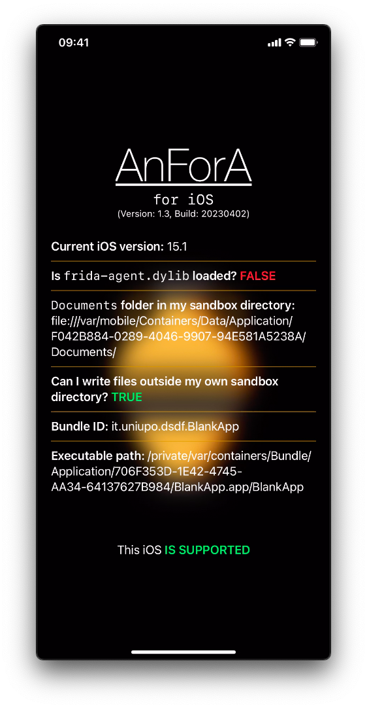
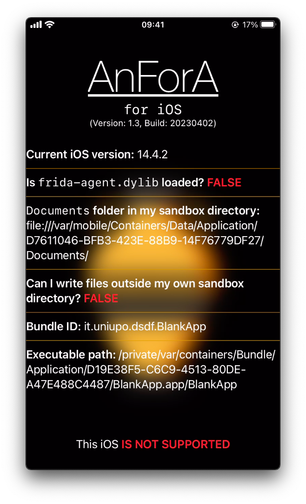

# blank-app

This app is an experimental project.
To run this app, you will need an iOS device with version 15.0 or later.
However, you can install the app on an iOS 14 device by modifying the `MinimumOSVersion` property in the `Info.plist file.

> **Warning**<br/>
> This information is valid up to commit .
> After this commit, the app will still install on an iOS 14 device, but it will crash when you try to open it.
> Upon investigation, I discovered that the problem lies with the Divider() component.
> Although I am unsure of the reason, removing the `Divider()` component will allow the app to run on an iOS 14 device: compiling for iOS 15 and changing the `MinimumOSVersion` property as described above.
> It is worth noting that the `Divider() component was introduced in iOS 13, not iOS 15.

It is important to keep in mind that setting a minimum iOS version for the app means that the app requires certain features that are not available in earlier versions of iOS.

After compiling the app, you will find three IPA files in the `build folder:
- `AnForA14.ipa` for iOS 14 and later.
- `AnForA15.ipa` for iOS 15 and later.
- `AnForA.tipa` for iOS versions that support [TrollStore](https://github.com/opa334/TrollStore) because they are vulnerable to [CoreTrust (CT) bug](https://worthdoingbadly.com/coretrust/).

<span><!-- https://discord.com/channels/349243932447604736/688126462066163756/1091172915208265768 --></span>
The `tipa` extension is preferred by AirDrop, as AirDrop does not transfer IPA files.

> **Note**<br/>
> The `AnForA.tipa` file **cannot be sideloaded**, as it has the `com.apple.private.security.no-sandbox` entitlement, which allows it to write outside its sandbox.
> When you open the app, it will attempt to create (or overwrite) an empty file in `/var/mobile/file.txt`.
> If this is successful, you will see “YES” next to the question “Can I write files outside my own sandbox directory?”
> To see the sandbox path, look for the "Documents folder in my sandbox directory".
> If the app is unable to write outside its sandbox, an error message will be produced, which can be read using `idevicedebug:
> ```shell
> idevicedebug -ddd run it.uniupo.dsdf.BlankApp
> ```
> The error message will read out:
> ```text
> Error creating file: You don’t have permission to save the file “file.txt” in the folder “mobile”.
> ```

Every app that you build with Xcode contains a [provisioning file](https://developer.apple.com/documentation/technotes/tn3125-inside-code-signing-provisioning-profiles) which specifies the entitlements that can be used for a specific app.
These files are digitally signed, so they can't be altered.
While you can create your provisioning file, you must enroll in the Apple Developer Program to do so. 
However, this doesn't mean that you can use every possible entitlement.

<span><!-- https://discord.com/channels/779134930265309195/944462595996405810/1087048714524315728 --></span>
In general it's necessary to have a JB or certain types of exploits to use most entitlements.

> **Warning**<br>
> <span><!-- https://sideloadly.io/#faq --></span>
> Another limitation with a Free Apple Developer account is that you can only create up to 10 App IDs every 7 days, after which you'll receive the error message: `Your maximum App ID limit has been reached`. 
> Unfortunately, there is no proper solution to this issue. 
> One workaround is to reuse a previously used App ID but you **cannot install** two apps with the same App ID. 
> After 7 days, the oldest provisioning file will expire, and you can then use its App ID. 
> Alternatively, you can create a new Apple ID.
> Additionally, with a free account, you can only register a maximum of 5 iDevices with your development team ID. 
> Once this limit is reached, `xcodebuild` will show the error message: `Your development team has reached the maximum number of registered iPhone devices.`
> Lastly, for iOS 10, 11, 12, 13, 14, 15, 16, and higher, Apple has limited the number of sideloaded apps that you can install on your device to 3 at a time for free Apple Developer accounts. 
> Paid Apple Developer accounts do not have such limitations.

## How to pack it into IPA?

1. Clone this project:
   ```shell
   git clone --depth=1 -j8 https://github.com/miticollo/blank-app.git
   ```
2. `xcodebuild` is shipped with Xcode so if necessary you can set the following ENV to use a different Xcode release:
   ```shell
   # I use the latest version of Xcode
   export DEVELOPER_DIR=/Applications/Xcode.app/Contents/Developer
   ```
3. Run
   ```shell
   ./build.sh
   ```
   Note that in order to compile it with a free developer account, you must override the `DEVELOPMENT_TEAM` variable using the `--certificate` option. 
   The `--certificate` option requires **the full name** of your certificate. 
   You can find it using the following command:
   ```shell
   security find-identity -p codesigning -v
   ```
   See also [here](https://github.com/miticollo/test-appium#team-id).

The IPAs are in `build` directory.

To clean build folders you can use `./build.sh -c`.

## Result

There are two screenshots available for the iPhone XR, highlighting two key differences. 
The first difference is the bundleID, while the second is the app’s ability to write outside its sandbox. 
The app with the bundleID `it.moo.BlankApp` was installed through sideloading, whereas the other app was installed through TrollStore.

A similar output is expected for the iPhone X. 
However, in this case, the app can only write outside its sandbox if iOS is in a jailbroken state. 
<span><!-- https://discord.com/channels/779134930265309195/944462595996405810/1087120624129941737 --></span>
This is because the PongoOS KPF applies a patch that permits it.

iPhone XR with iOS 15.1b1 (TrollStore)       |  iPhone XR with iOS 15.1b1
:-------------------------------------------:|:-----------------------------------------:
   |  
iPhone 14 Pro Max with iOS 16.2 (simulator)  |  iPhone SE 2020 with iOS 14.4.2 
      |  

> **Note**<br>
> In the simulator screenshot, you can see that it has its own folder in the macOS filesystem: `~/Library/Developer/CoreSimulator/Devices/<DEVICE-ID>. 
> So, can we use a simulator device for AnForA? 
> Before answering this question, we must ask ourselves: how can we create and set up a simulator?
> 1. Download a runtime (e.g. for iOS 16.1) using [`xcodes`](https://github.com/RobotsAndPencils/xcodes).
>    ```shell
>    xcodes runtimes install 'iOS 16.1'
>    ```
> 2. Verify that the installation was successful.
>    ```shell
>    xcrun -v simctl runtime list -v
>    ```
> 3. Create a new device.
>    ```shell
>    xcrun -v simctl create 'AnForA' 'iPhone 14 Pro Max' 'iOS16.1'
>    ```
>    Save the `<DEVICE-ID>` returned by this command.
> 4. Boot the device.
>    ```shell
>    xcrun -v simctl boot 'F74E321C-CCEE-499E-9617-6409D41CDE60'
>    ```
> 5. Open Simulator app to interact with simulator we have just created.
>    ```shell
>    open /Applications/Xcode.app/Contents/Developer/Applications/Simulator.app/
>    ```
> 6. Install the Session app.
>    ```shell
>    ipatool --verbose download -b 'com.loki-project.loki-messenger' --purchase
>    unzip ./com.loki-project.loki-messenger_1470168868_v2.2.9_561.ipa
>    xcrun -v simctl install 'F74E321C-CCEE-499E-9617-6409D41CDE60' ./Payload/Session.app
>    ```
> 7. Do your things.
> 8. Shutdown **ALL** devices.
>    ```shell
>    xcrun -v simctl shutdown all
>    ```
> 9. Delete the device we just created.
>    ```shell
>    xcrun -v simctl delete 'AnForA'
>    ```
>
> Now we can return to the main question: can we use a simulator device for AnForA?
> Maybe, but to be sure, I need a Mac with M1 or M2.
